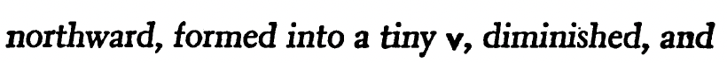
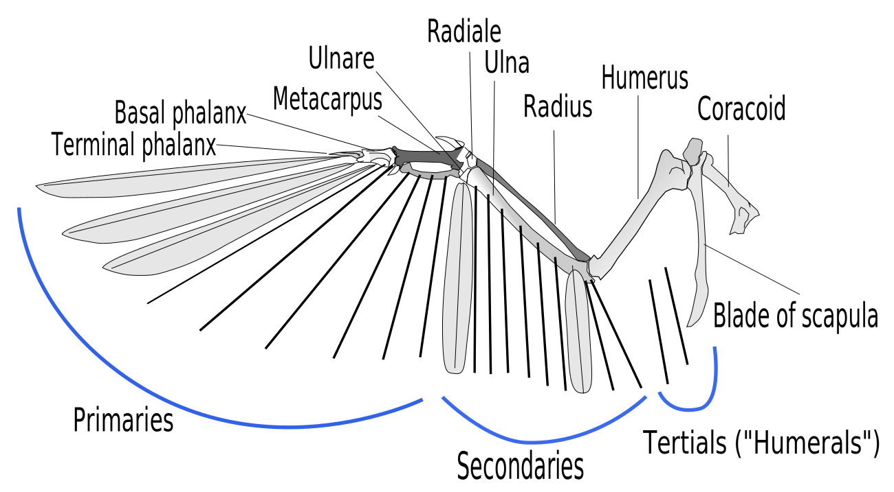

I just read *The Snow Goose* by Paul Gallico, and I learned some bird tidbits I wanted to share!

## skeins

<figure>
	
	<figcaption><a href="https://commons.wikimedia.org/wiki/File:A_Sky_Full_of_Snow_Geese_(16664971147).jpg">USFWS Mountain-Prairie</a>, <a href="https://creativecommons.org/licenses/by/2.0">CC BY 2.0</a>, via Wikimedia Commons</figcaption>
</figure>

> “Tamed in his enclosures were the geese that came winging down the coast from Iceland and Spitsbergen each October, in great **skeins** that darkened the sky and filled the air with the rushing noise of their passage–the brown-bodied pink-feet, white-breasted barnacles with their dark neck and clowns' masks, the wild white fronts with black-barred breasts, and many species of wild ducks–widgeon, mallard, pintails, teal, and shovelers” (Gallico 11–12; emphasis added).

Flocks of geese or ducks are called **skeins**! [This is the same word as a length of yarn](https://www.merriam-webster.com/dictionary/skein) (“Skein”). I was a bit confused with the connection, but [the Scottish Wildlife Trust says](https://scottishwildlifetrust.org.uk/2020/09/why-do-we-call-them-skeins-of-geese/), “[w]ith their very efficient, orderly lines, they can kind of look like a long piece of wool gliding through the sky, rippling as the geese change positions.” Who knows, though, because they even concede it's a “bit of an etymological mystery.”

I also adore how the edition of the book I was reading typeset the flock's formation as a tiny **v**.

<figure>
	
	<figcaption>(Gallico 24)</figcaption>
</figure>

## primaries

<figure>
	
	<figcaption><a href="https://commons.wikimedia.org/wiki/File:Birdwing.svg">L. Shyamal</a>, <a href="https://creativecommons.org/licenses/by-sa/2.5">CC BY-SA 2.5</a>, via Wikimedia Commons</figcaption>
</figure>

> “Some were **pinioned**, so that they would remain there as a sign and signal to the wild ones that came down at each winter's beginning that here was food and sanctuary” (Gallico 12; emphasis added).

The main character, Philip Rhayader, is a kind man to all wildlife, and the birds all very much like him, so I was confused why he would pinion–bind the wings of–some birds that visited him. However, it seems pretty common to pinion a bird, and it looks like they might grow back?

> “See, we will clip her **primaries** so that we can bandage it, but in the spring the feathers will grow and she will be able to fly again” (Gallico 19; emphasis added).

These pinions are the outermost primaries, which are flight feathers that allow a bird to take flight!

---

Those are all for now, but it was such a great read! If you are interested in reading *The Snow Goose* [you can read an e-book scan here](https://catalog.hathitrust.org/Record/001112530) or [find it in print at a library (WorldCat)](https://search.worldcat.org/en/title/284978).

## Works Cited

	
Gallico, Paul. <i>The Snow Goose</i>. A. A. Knopf, 1941. <i>HathiTrust Digital Library</i>, <a href="https://hdl.handle.net/2027/uc1.b3688343">hdl.handle.net/2027/uc1.b3688343</a>. Accessed 22 Jan. 2025.

	
“Skein.” <i>Merriam-Webster.com Dictionary</i>, Merriam-Webster, <a href="https://www.merriam-webster.com/dictionary/skein">merriam-webster.com/dictionary/skein</a>. Accessed 22 Jan. 2025.

	
“Why Do We Call Them ‘skeins’ of Geese?” <i>Scottish Wildlife Trust</i>, 25 Sept. 2020, <a href="https://scottishwildlifetrust.org.uk/2020/09/why-do-we-call-them-skeins-of-geese">scottishwildlifetrust.org.uk/2020/09/why-do-we-call-them-skeins-of-geese</a>. Accessed 22 Jan. 2025.

